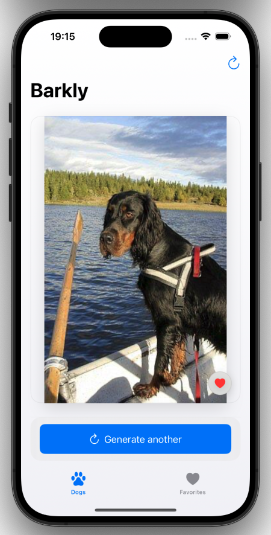
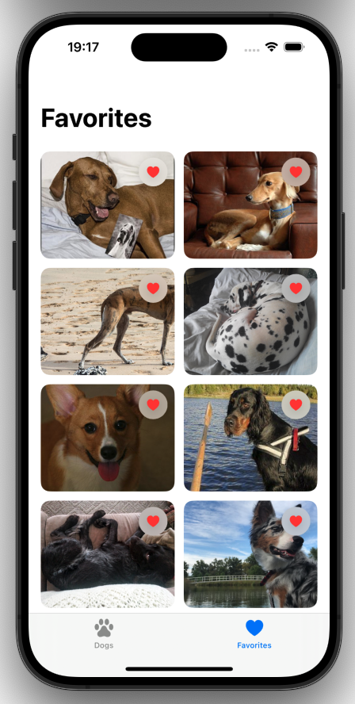
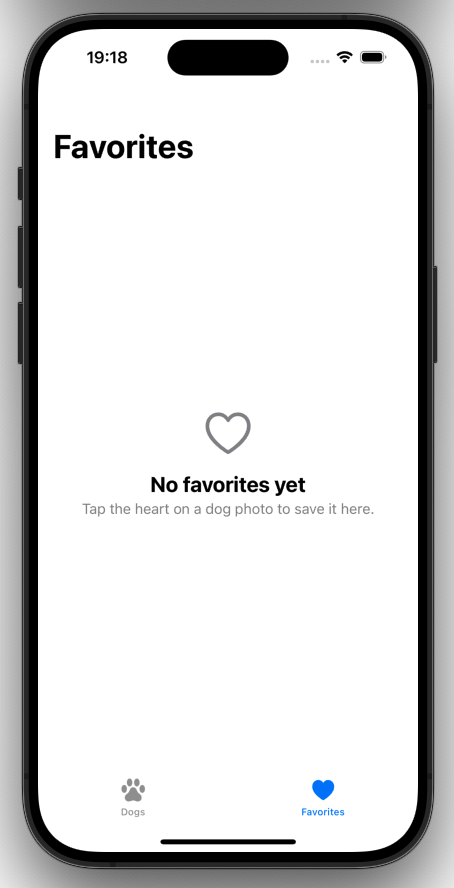

# Barkly

Barkly is a simple iOS app that displays random dog images and allows users to save their favorites.

## Overview

The app fetches random dog images from a public API and lets users add them to a favorites list.  
It focuses on clean architecture, state management, and testable code.

## Features

- Fetch random dog images
- Add/remove favorites
- Favorites persistence using UserDefaults
- In-memory image caching
- Responsive UI with SwiftUI
- Error handling and loading states

## Screenshots

| Random Dog | Favorites | Empty State |
|-----------|----------|-------------|
|  |  |  |

## Architecture

The app follows a simple modular structure:

- **Features**
  - RandomDog
  - Favorites

- **Core**
  - Networking (DTO, services)
  - Persistence

- **Shared**
  - Image loading & caching

### Key principles

- Dependency Injection
- Separation of concerns
- Testable components
- Lightweight MVVM

## Tech Stack

- Swift
- SwiftUI
- async/await
- NSCache (image caching)
- UserDefaults (persistence)

## Testing

The project includes unit tests for:

- FavoritesStore
- UserDefaultsFavoritesPersistence
- ImageCache
- ImageClient

Test coverage includes:
- State management
- Persistence logic
- Caching behavior
- Network handling (mocked)

## Future Improvements

- Detail screen for images
- Save image to device
- Better error UI
- Pagination / multiple images
